# Watchy Application Suite

A complete application-focused firmware for the Watchy open-source e-paper
watch. It provides **142 applications across 10 task-oriented menu
categories**, a consistent Watchy OS interface, deterministic public
screenshots, and a lightweight SDK for adding more applications.

Start with the [documentation index](docs/readme.md) for firmware architecture,
gallery capture, calibration studies, timing validation, and measured build
results.

The one-to-five screenshots for each app come directly from the real
`200x200`, 1-bit firmware framebuffer. They are not UI mockups. Public-safe
fixtures provide the fixed time, sensor readings, health profile, locations,
and network results shown in the gallery; normal firmware uses live hardware
and configured data.

The SDK calibration scenes expose the spatial-dither ramp, semantic tones,
widget states, dialogs, lists, disabled controls, and graph rendering used on
the 1-bit panel.

| Gray8 ramp | Light tones | Dark tones |
| --- | --- | --- |
| 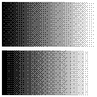 | 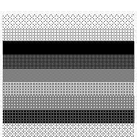 | 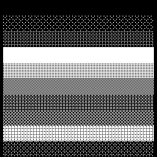 |
| 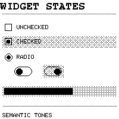 | 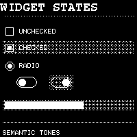 | 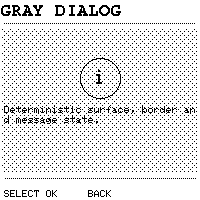 |
| 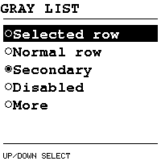 | 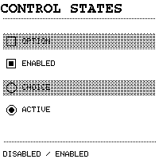 | 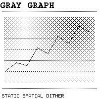 |

Every WatchFace also has an independent pixel-golden baseline in light and
dark polarity. These images use fixed time, weather, steps, battery, and BPM
fixtures; normal firmware continues to read live hardware.

| WatchFace | Light | Dark |
| --- | --- | --- |
| 7-SEG | 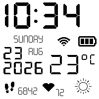 | 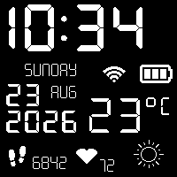 |
| Basic | 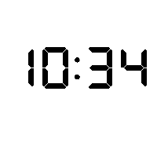 | 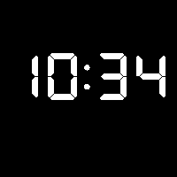 |
| DOS | 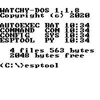 | 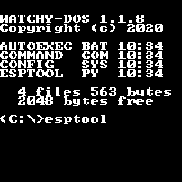 |
| MacPaint | 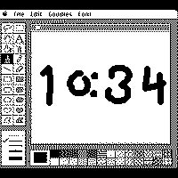 | 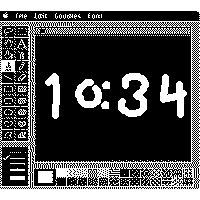 |
| Mario | 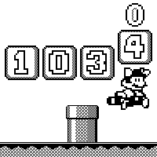 | 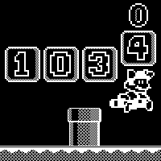 |
| Pokemon | 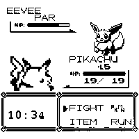 | 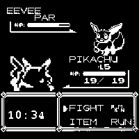 |
| Starry Horizon | 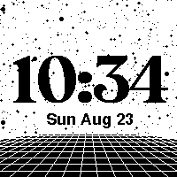 | 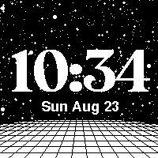 |
| Tetris | 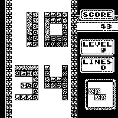 | 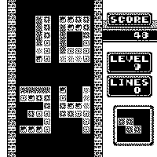 |

## Watchy OS

Watchy OS presents every feature through a two-level category menu with
consistent typography, selection, input, themes, and display lifecycle. The
root view provides access to all ten application groups.


| Menu category | Applications |
| --- | ---: |
| Clocks & Sky | 16 |
| Timers & Focus | 6 |
| Health & Care | 15 |
| Safety & Aid | 20 |
| Sensors & Steps | 18 |
| Everyday Tools | 13 |
| Games & Puzzles | 15 |
| Network & Web | 9 |
| Bluetooth | 16 |
| Watch & System | 14 |
| **Total** | **142** |

| | |
| --- | --- |
| 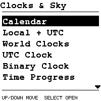 | 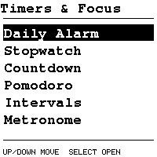 |
| 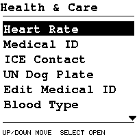 | 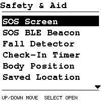 |
| 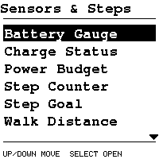 | 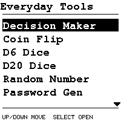 |
| 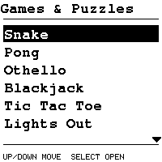 | 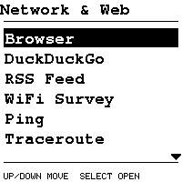 |
|  | 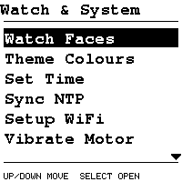 |

The on-watch order puts everyday time, health, safety, and sensor workflows
first. The gallery below remains grouped by stable implementation family:
[System](#system) · [Utilities](#utilities) · [Networking](#networking) ·
[Astronomy](#astronomy) · [Healthcare](#healthcare) · [Games](#games) ·
[Clocks](#clocks) · [Time Tools](#time-tools) · [Sensors](#sensors) ·
[Bluetooth](#bluetooth).

## System

Core Watchy OS configuration, identity, connectivity, watch-face selection,
and appearance controls.

| Application | What it does | Screenshot 1 | Screenshot 2 | Screenshot 3 | Screenshot 4 | Screenshot 5 |
| --- | --- | --- | --- | --- | --- | --- |
| **About Watchy** | Displays firmware, hardware, and project information. |  |  |  |  |  |
| **Set Time** | Provides an on-watch editor for the local date and time. |  |  |  |  |  |
| **Setup WiFi** | Configures Wi-Fi and reports the resulting connection state. | 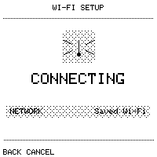 |  | 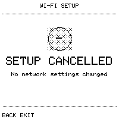 | 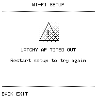 | 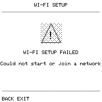 |
| **Watch Faces** | Selects the active watch face from the installed collection. |  |  |  |  |  |
| **Theme Colours** | Switches the shared Watchy OS interface between light and dark themes. |  | 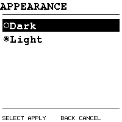 |  |  |  |

## Utilities

Everyday randomizers, diagnostics, hardware tools, generators, and unit
converters.

| Application | What it does | Screenshot 1 | Screenshot 2 | Screenshot 3 | Screenshot 4 | Screenshot 5 |
| --- | --- | --- | --- | --- | --- | --- |
| **Vibrate Motor** | Runs a short haptic motor test from the Utilities menu. |  |  |  |  |  |
| **Accelerometer** | Shows the current three-axis accelerometer reading and orientation. |  | 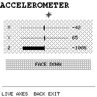 | 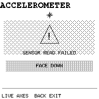 |  |  |
| **Sync NTP** | Synchronizes the RTC with an internet time source and reports success or failure. | 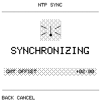 |  | 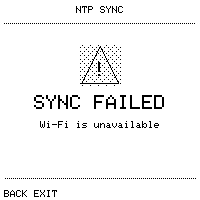 |  |  |
| **Coin Flip** | Produces a quick heads-or-tails decision. |  | 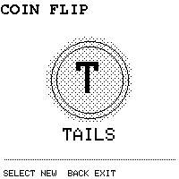 |  |  |  |
| **D6 Dice** | Rolls a standard six-sided die. | 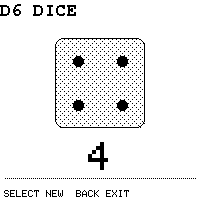 |  |  |  |  |
| **D20 Dice** | Rolls a twenty-sided tabletop die. | 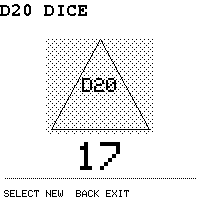 |  |  |  |  |
| **Random Number** | Generates a reusable random numeric value. | 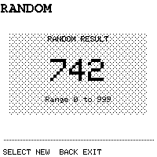 |  |  |  |  |
| **Decision Maker** | Answers a simple yes-or-no choice. |  | 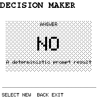 |  |  |  |
| **Password Generator** | Creates a compact mixed-character password on the watch. | 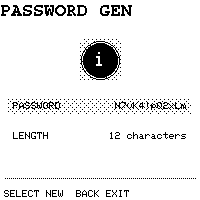 |  |  |  |  |
| **UUID Generator** | Creates and displays a standards-shaped UUID. | 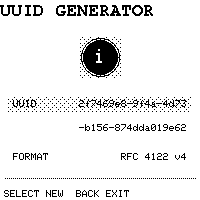 |  |  |  |  |
| **I2C Scanner** | Probes the I2C bus and lists responding device addresses. |  |  |  |  |  |
| **Chip Info** | Summarizes the ESP32-S3, CPU, flash, and SDK configuration. |  |  |  |  |  |
| **Heap Monitor** | Reports free heap, minimum free heap, and largest available block. |  |  |  |  |  |
| **Wake Reason** | Explains which wake source resumed the watch. |  |  |  |  |  |
| **Reset Reason** | Reports the ESP32 reset cause and raw reason code. |  |  |  |  |  |
| **Button Tester** | Counts input events so every physical button can be checked. |  |  |  |  |  |
| **Vibration Lab** | Selects and previews repeatable haptic patterns. |  |  |  |  |  |
| **Screen Ruler** | Draws a calibrated on-screen ruler for quick measurements. |  |  |  |  |  |
| **Temperature Converter** | Converts between Celsius and Fahrenheit. |  |  |  |  |  |
| **Length Converter** | Converts common metric and imperial lengths. |  |  |  |  |  |
| **Weight Converter** | Converts common metric and imperial weights. |  |  |  |  |  |
| **Base Converter** | Displays a number in decimal, hexadecimal, octal, and binary. |  |  |  |  |  |
| **Pace Converter** | Converts running pace between common distance units. |  |  |  |  |  |

## Networking

Compact network inspection and text-retrieval tools. Scanning tools must only
be used on networks and hosts you are authorized to test.

| Application | What it does | Screenshot 1 | Screenshot 2 | Screenshot 3 | Screenshot 4 | Screenshot 5 |
| --- | --- | --- | --- | --- | --- | --- |
| **Browser** | Fetches and presents a compact text-oriented web page. |  |  |  |  |  |
| **RSS Feed** | Retrieves a feed and displays recent item titles and summaries. |  |  |  |  |  |
| **Ping** | Measures reachability, replies, and round-trip latency. |  |  |  |  |  |
| **Traceroute** | Lists the network hops observed on the path to a host. |  |  |  |  |  |
| **Port Scanner** | Checks a focused set of common TCP ports on an authorized host. |  |  |  |  |  |
| **DNS Query** | Resolves a host name and displays the DNS result and status. |  |  |  |  |  |
| **Reverse DNS** | Resolves an IP address back to its PTR host name. |  |  |  |  |  |
| **DuckDuckGo** | Runs a lightweight web search and lists compact results. |  |  |  |  |  |
| **WiFi Survey** | Lists nearby access points with channel, RSSI, security, and BSSID. |  |  |  |  |  |

## Astronomy

Daily solar, lunar, and tidal information using configured locations and
stations.

| Application | What it does | Screenshot 1 | Screenshot 2 | Screenshot 3 | Screenshot 4 | Screenshot 5 |
| --- | --- | --- | --- | --- | --- | --- |
| **Sun Rise** | Calculates sunrise, sunset, and daylight information for a location. |  |  |  |  |  |
| **Moon Rise** | Calculates moonrise and moonset times for a location. |  |  |  |  |  |
| **Moon Phase** | Shows the current lunar phase, age, and illumination. |  |  |  |  |  |
| **Tides** | Displays four daily tide events, coefficients, range, and station data. |  |  |  |  |  |

## Healthcare

Medical identity, safety monitoring, reminders, emergency references, and
guided wellbeing tools. These features are informational aids and are not a
substitute for professional medical care or emergency services.

| Application | What it does | Screenshot 1 | Screenshot 2 | Screenshot 3 | Screenshot 4 | Screenshot 5 |
| --- | --- | --- | --- | --- | --- | --- |
| **Heart Rate** | Estimates pulse using experimental accelerometer-based ballistocardiography. |  |  |  |  |  |
| **UN Dog Plate** | Formats emergency identity and medical details in a compact plate-style view. |  |  |  |  |  |
| **Medical ID** | Presents a concise emergency summary from the configured medical profile. |  |  |  |  |  |
| **ICE Contact** | Displays the configured in-case-of-emergency contact. |  |  |  |  |  |
| **Blood Type** | Shows the configured blood group prominently for emergency reference. |  |  |  |  |  |
| **Allergies** | Lists important configured allergies. |  |  |  |  |  |
| **Medications** | Lists current configured medications. |  |  |  |  |  |
| **Conditions** | Lists relevant configured medical conditions. |  |  |  |  |  |
| **Edit Medical ID** | Provides an on-watch editor for the emergency medical profile. |  |  |  |  |  |
| **Fall Detector** | Runs live detection or records bounded background candidate traces for calibration. |  |  |  |  |  |
| **Body Position** | Reports body or watch orientation for quick safety assessment. |  |  |  |  |  |
| **Saved Location** | Displays the configured emergency location details. |  |  |  |  |  |
| **SOS Screen** | Shows a high-contrast emergency message and essential identity details. |  |  |  |  |  |
| **SOS BLE Beacon** | Broadcasts a configured emergency payload over Bluetooth Low Energy. |  |  |  |  |  |
| **Check-In Timer** | Starts a safety timer that expects the wearer to acknowledge before expiry. |  |  |  |  |  |
| **Medication Alert** | Enables and displays a recurring medication reminder. |  |  |  |  |  |
| **Hydration Alert** | Enables and displays a recurring hydration reminder. |  |  |  |  |  |
| **Breathing Coach** | Guides paced inhale and exhale intervals. |  |  |  |  |  |
| **CPR Metronome** | Provides a steady compression cadence reference for CPR. |  |  |  |  |  |
| **Recovery Position** | Presents concise recovery-position guidance. |  |  |  |  |  |
| **Stroke FAST** | Presents the Face, Arms, Speech, Time stroke-recognition checklist. |  |  |  |  |  |
| **Choking Response** | Shows concise first-aid steps for a choking emergency. |  |  |  |  |  |
| **Seizure Aid** | Shows immediate safety guidance for assisting during a seizure. |  |  |  |  |  |
| **Severe Bleeding** | Presents first-aid actions for controlling severe bleeding. |  |  |  |  |  |
| **Burn First Aid** | Presents immediate first-aid guidance for burns. |  |  |  |  |  |
| **Heat Emergency** | Lists recognition and response steps for heat illness. |  |  |  |  |  |
| **Hypothermia** | Lists recognition and response steps for dangerous cold exposure. |  |  |  |  |  |
| **Poisoning** | Presents immediate poisoning response guidance and cautions. |  |  |  |  |  |
| **Anaphylaxis** | Presents urgent response guidance for severe allergic reactions. |  |  |  |  |  |
| **Opioid Overdose** | Presents recognition and naloxone-oriented emergency guidance. |  |  |  |  |  |
| **Asthma Attack** | Presents immediate response guidance for an asthma attack. |  |  |  |  |  |
| **Emergency Numbers** | Keeps important emergency telephone numbers available offline. |  |  |  |  |  |
| **Pain Log** | Records a quick pain-intensity entry for later reference. |  |  |  |  |  |
| **Symptom Note** | Stores a compact symptom note and timestamp. |  |  |  |  |  |
| **5-4-3-2-1 Calm** | Guides the five-senses grounding exercise one step at a time. |  |  |  |  |  |

## Games

Fifteen compact games and reaction challenges designed for four-button play on
the e-paper display.

| Application | What it does | Screenshot 1 | Screenshot 2 | Screenshot 3 | Screenshot 4 | Screenshot 5 |
| --- | --- | --- | --- | --- | --- | --- |
| **Morse Letter** | Challenges the player to identify a letter from Morse code. |  |  |  |  |  |
| **Morse Code** | Challenges the player to choose the Morse sequence for a letter. |  |  |  |  |  |
| **Pong** | Plays a compact paddle-and-ball game. |  |  |  |  |  |
| **Snake** | Grows a snake while avoiding walls and its own trail. |  |  |  |  |  |
| **Othello** | Implements the classic disk-flipping strategy game. |  |  |  |  |  |
| **Rock Paper Scissors** | Plays a scored round against the watch. |  |  |  |  |  |
| **Reaction Test** | Measures response time after a randomized start signal. |  |  |  |  |  |
| **Higher Lower** | Guesses whether the next value will be higher or lower. |  |  |  |  |  |
| **Number Guess** | Narrows down a hidden number using higher and lower hints. |  |  |  |  |  |
| **Nim** | Removes objects strategically while playing against the watch. |  |  |  |  |  |
| **Tic Tac Toe** | Plays a compact three-by-three noughts-and-crosses game. |  |  |  |  |  |
| **Lights Out** | Toggles a five-by-five grid with the goal of clearing every light. |  |  |  |  |  |
| **Blackjack** | Plays a simplified hand of blackjack against the dealer. |  |  |  |  |  |
| **Quick Math** | Presents short arithmetic questions and tracks correct answers. |  |  |  |  |  |
| **Balance** | Uses the accelerometer to keep an indicator centered. |  |  |  |  |  |

## Clocks

Alternative representations of civil, global, astronomical, and progress-based
time.

| Application | What it does | Screenshot 1 | Screenshot 2 | Screenshot 3 | Screenshot 4 | Screenshot 5 |
| --- | --- | --- | --- | --- | --- | --- |
| **Binary Clock** | Encodes the current hour, minute, and second as binary columns. |  |  |  |  |  |
| **Unix Time** | Displays the current Unix epoch timestamp. |  |  |  |  |  |
| **UTC Clock** | Shows the current Coordinated Universal Time. |  |  |  |  |  |
| **ISO Week** | Displays the ISO week number and ISO weekday context. |  |  |  |  |  |
| **Day of Year** | Shows the ordinal day and remaining days in the year. |  |  |  |  |  |
| **Calendar** | Renders a complete month calendar with the current day highlighted. |  |  |  |  |  |
| **World Clocks** | Compares the current time across several world cities. |  |  |  |  |  |
| **Local + UTC** | Places local time and UTC side by side. |  |  |  |  |  |
| **Internet Beats** | Converts the day into Swatch Internet Time beats. |  |  |  |  |  |
| **Decimal Time** | Represents the current day using decimal hours and subdivisions. |  |  |  |  |  |
| **Julian Day** | Displays the astronomical Julian Date. |  |  |  |  |  |
| **Time Progress** | Visualizes progress through the day, month, and year. |  |  |  |  |  |

## Time Tools

Timers, alarms, interval pacing, and rhythm tools.

| Application | What it does | Screenshot 1 | Screenshot 2 | Screenshot 3 | Screenshot 4 | Screenshot 5 |
| --- | --- | --- | --- | --- | --- | --- |
| **Stopwatch** | Measures elapsed time and records lap information. |  |  |  |  |  |
| **Countdown** | Runs an adjustable countdown timer. |  |  |  |  |  |
| **Daily Alarm** | Configures a recurring local-time vibration alarm. |  |  |  |  |  |
| **Pomodoro** | Alternates focused work and break countdowns. |  |  |  |  |  |
| **Intervals** | Alternates configurable work and rest periods. |  |  |  |  |  |
| **Metronome** | Runs a stable 30-240 BPM haptic tempo with remembered accent settings. |  |  |  |  |  |

## Sensors

Battery, motion, activity, health, and runtime diagnostics from Watchy's
on-board hardware.

| Application | What it does | Screenshot 1 | Screenshot 2 | Screenshot 3 | Screenshot 4 | Screenshot 5 |
| --- | --- | --- | --- | --- | --- | --- |
| **Battery Gauge** | Shows calibrated voltage, percentage, and remaining capacity. |  |  |  |  |  |
| **Power Budget** | Estimates remaining energy and runtime from the battery model. |  |  |  |  |  |
| **Charge Status** | Reports USB presence, charging state, voltage, and charge level. |  |  |  |  |  |
| **BMA Temperature** | Displays the accelerometer's internal temperature reading. |  |  |  |  |  |
| **Raw Accel** | Shows raw X, Y, and Z acceleration samples. |  |  |  |  |  |
| **G Force** | Converts the acceleration vector into magnitude measured in g. |  |  |  |  |  |
| **Spirit Level** | Uses acceleration to provide a two-axis level indicator. |  |  |  |  |  |
| **Orientation** | Classifies the current face-up, face-down, or side orientation. |  |  |  |  |  |
| **Motion Score** | Summarizes recent movement intensity as a compact score. |  |  |  |  |  |
| **Step Counter** | Displays the BMA423 hardware step count. |  |  |  |  |  |
| **Step Goal** | Shows progress toward the configured daily step target. |  |  |  |  |  |
| **Walk Distance** | Estimates distance traveled from step count. |  |  |  |  |  |
| **Step Calories** | Estimates activity calories from step count. |  |  |  |  |  |
| **Activity State** | Reports the BMA423 activity classifier state. |  |  |  |  |  |
| **Sensor Status** | Summarizes accelerometer enablement, status, errors, and sensor time. |  |  |  |  |  |
| **Uptime** | Shows elapsed time since the last cold boot. |  |  |  |  |  |
| **Shake Counter** | Counts deliberate shakes detected by the accelerometer. |  |  |  |  |  |

## Bluetooth

BLE discovery, signal analysis, advertisement inspection, and configurable
Watchy beacon modes.

| Application | What it does | Screenshot 1 | Screenshot 2 | Screenshot 3 | Screenshot 4 | Screenshot 5 |
| --- | --- | --- | --- | --- | --- | --- |
| **BLE Scanner** | Lists nearby Bluetooth Low Energy devices and signal strength. |  |  |  |  |  |
| **Device Count** | Summarizes discovered, named, service-bearing, and manufacturer-bearing devices. |  |  |  |  |  |
| **Strongest Signal** | Highlights the nearest or strongest observed BLE advertiser. |  |  |  |  |  |
| **Named Devices** | Filters scan results to advertisers with readable device names. |  |  |  |  |  |
| **Service UUIDs** | Lists advertised Bluetooth service UUIDs. |  |  |  |  |  |
| **Manufacturer IDs** | Lists manufacturer identifiers found in advertisement data. |  |  |  |  |  |
| **RSSI Bands** | Groups nearby devices into close, near, and far signal bands. |  |  |  |  |  |
| **BLE Addresses** | Lists observed BLE addresses and RSSI values. |  |  |  |  |  |
| **BLE Radar** | Visualizes nearby devices as comparative signal-strength bars. |  |  |  |  |  |
| **TX Power Survey** | Summarizes advertised transmit-power values. |  |  |  |  |  |
| **iBeacon Watch** | Counts nearby iBeacon and Apple manufacturer packets. |  |  |  |  |  |
| **Watchy Beacon** | Advertises a generic Watchy identity over BLE. |  |  |  |  |  |
| **Battery Beacon** | Advertises the standard BLE battery service. |  |  |  |  |  |
| **Time Beacon** | Advertises deterministic time data in a service payload. |  |  |  |  |  |
| **Step Beacon** | Advertises the current step count through a custom service. |  |  |  |  |  |
| **Name Badge** | Advertises a configured readable device name. |  |  |  |  |  |

## Build And Install

This project targets Watchy v3 / ESP32-S3 and uses PlatformIO:

```powershell
pio run -e esp32-s3-devkitc-1
pio run -e esp32-s3-devkitc-1 -t upload --upload-port COM3
```

Change `COM3` to the port assigned to your Watchy. The upstream hardware setup
guide is available at [watchy.sqfmi.com/docs/getting-started](https://watchy.sqfmi.com/docs/getting-started).

For RTC-retained power proxies such as wake counts, awake time, display work,
radio-on time, sensor wakes, and minimum heap, use the optional diagnostics
build. It writes no telemetry to NVS/Flash and prints `@WATCHY_POWER` records at
115200 baud:

```powershell
pio run -e power-diagnostics -t upload --upload-port COM3
pio device monitor --port COM3 --baud 115200
```

Measured code-path deltas, current binary size, and the remaining physical
measurement matrix are tracked in
[Power Optimization Results](docs/power-optimization-results.md).
The candidate sensor-rate studies are documented separately in
[BCG Sample-Rate Study](docs/bcg-rate-study.md) and
[Step Counter ODR Study](docs/step-odr-study.md). Metronome scheduling evidence
and the pending hardware jitter protocol are in
[Metronome Timing](docs/metronome-timing.md).

## Verification

Run the complete host suite and verify generated gallery metadata before a
pull request:

```powershell
python -m unittest discover -s tools -p "test_*.py"
python tools/sync_gallery_catalog.py --check
pio run -e esp32-s3-devkitc-1
```

The current suite contains 68 tests. The catalog check reports 142
applications and 348 deterministic scenes.

## Application SDK

Applications share standard screens, lists, value editors, semantic input,
feedback, themes, and durable settings. See the
[Watchy Application SDK](docs/watchy-sdk.md)
and the [Standard Counter example](examples/Apps/StandardCounter/StandardCounter.cpp).

## Rebuild The Gallery

The isolated gallery firmware captures every renderer without reading private
settings or activating the panel, radios, sensors, vibration, storage, or
sleep. The receiver rejects incomplete, reordered, duplicate, malformed, or
CRC-invalid frames.

```powershell
python -m pip install -r tools/requirements-gallery.txt
python tools/sync_gallery_catalog.py
pio run -e gallery -t upload --upload-port COM3
python tools/capture_gallery.py --port COM3 --output docs/gallery --replace
python -m unittest tools.test_capture_gallery
pio run -e esp32-s3-devkitc-1 -t upload --upload-port COM3
```

See the [deterministic gallery documentation](docs/deterministic-gallery.md)
and its machine-readable [capture manifest](docs/gallery/manifest.json).

## Project Links

- [Watchy documentation](https://watchy.sqfmi.com/docs/getting-started)
- [Watchy case and accessories](https://shop.sqfmi.com)
- [Community Discord](https://discord.gg/ZXDegGV8E7)
- [Contributing](contributing.md)
- [License](LICENSE)


