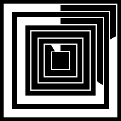

# Squarbital watch face
A watch face displaying the time in orbital mode, but in square

## Origin
I already made an orbital watch face (see Orbital), but I realised that the Watchy is square, not round.  And here we are.

## Features
Display the time and date, as well as the battery level, in a square-orbital fashion.

Here you can see the watch face showing 16h10, the 30th of November, with a 100% battery.

You can choose between light and dark theme, and choose to have the hour hand show the 24h time or the 12h like a "normal" watch.

For funnsies and because I already had the code,  I added a Morse mode. Press the up button, and the watch will vibrate in Morse the time (not the date, it would be a bit too long).  
Decoding Morse time is relatively easy with a bit of practise, and doesn't use your eyes, so might be helpful on some situations.

As a reminder, here is the Morse code used :

* 0 : — — — — —
* 1 : • — — — —
* 2 : • • — — —
* 3 : • • • — —
* 4 : • • • • —
* 5 : • • • • •
* 6 : — • • • •
* 7 : — — • • •
* 8 : — — — • •
* 9 : — — — — •

The time will be vibrating as "XX XX", always two block of two digits, with a space (silent) in between.  
Usually, Morse code is sent at the speed of ~60ms per dot (a dash being three dots). I choose 100ms instead, to facilitate comprehension. Don't thank me :) In any case, it can be easily edited in the code.

## How to use/install
I used PlatformIO.  
You can use `pio run -t upload` to compile and upload the project to your Watchy.

If you don't use PlatformIO, look at the `platformio.ini` to have a list of libs necessary for compilation.
