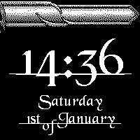

# Castle of Watchy

This is a watch face for the open E-Ink display smartwatch [Watchy](https://watchy.sqfmi.com/).  
It is inspired by the 'Castle of Heart'.

## Features

- Display battery state as a health meter.
- Display week day and date.
- Display time.

## Upload instructions

### I did not use Arduino IDE

I implemented BotWatchy using the [platformIO](https://platformio.org/) extension for VS Code, as I can't bear coding in the Arduino IDE anymore. I'm reasonably certain you can just clone this repo and open the project in any platformIO enabled IDE. All necessary dependencies should be installed automatically.  
I even added a `min_spiffs.csv` file and referenced it in the `platformio.ini`, which I think assures the compiler there's enough space on the ESP32 for all those bitmaps and stuff.  
What I want to say is: it's entirely possible platformIO will just compile and upload the code to your Watchy (but see right below first!).

### You want to change, modify or break the icons?

All used image assets are provided in the `assets` folder. Modify them to your heart's content and then use [image2cpp tool](http://javl.github.io/image2cpp/) to convert them. Make sure you tick 'Invert image colors', as I made the colors the wrong way around.  
I commented out the code related to the 'Array of all bitmaps for convenience' in the output code, as it was causing me inconvenience.

## Thanks and contributions

### mehtmehtsen - creator of BotWatchy face

I based this project on his [BotWatchy](https://github.com/mehtmehtsen/BotWatchy).

### Black Chancery
